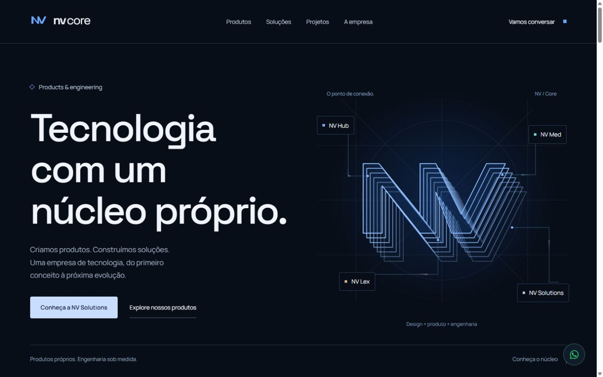

# Hero — Connection Pulse

Micro-refinamento de 7 de outubro de 2026, disponível na [prévia local](http://127.0.0.1:5175/).

## Implementação

Adicionados quatro sinais nas conexões existentes: Hub, Med, Lex e Solutions → Core. A geometria original de `connector-lines` permanece literalmente igual. Os paths sobrepostos percorrem essa mesma geometria na direção inversa, da origem ao ponto de entrada.

Cada sinal combina quatro segmentos curtos sobrepostos: halo discreto, rastro, corpo e núcleo luminoso. O `stroke-dashoffset` desloca o sinal pelo circuito, incluindo seus cotovelos. O comprimento real do path é lido uma vez por conexão; não há cálculo de posição ou leitura de layout a cada frame. Não foram usados filtros de blur, MotionPathPlugin, novas dependências ou React renders por frame.

As cores utilizam os tokens existentes de cada submarca. Partidas em 3,2 / 5,4 / 4,3 / 7,1 segundos permitem que a revelação original do hero termine primeiro. Os quatro percursos têm durações, intervalos e intensidades distintos; há um sinal por conexão. Na chegada, um pequeno halo azul no ponto de entrada cresce alguns pixels e dissipa em 320 ms. O NV inteiro não recebe uma nova animação.

No mobile, a intensidade é reduzida para 65%, os intervalos são multiplicados por 1,6 e a reação de chegada é menor. As linhas da versão mobile continuam sendo os próprios paths existentes.

O efeito usa o contexto GSAP já existente, com uma timeline principal e quatro ciclos. Um IntersectionObserver pausa o conjunto quando o diagrama está fora da tela; `visibilitychange` também pausa quando o documento está oculto. O cleanup desconecta o observer, remove o listener e elimina a timeline. `matchMedia` impede sua criação em movimento reduzido. Sem JavaScript, os sinais permanecem invisíveis.

## Escopo preservado

Foram alterados somente o diagrama do hero para inserir a camada de sinais e o ponto de integração no motion existente, além dos dois arquivos novos que implementam o efeito. Não houve edição de layout, copy, fontes, CTAs, proporções, cores principais, linhas originais, navegação, páginas internas, Product Showcase ou outras animações nesta rodada.

Não houve commit, push ou deploy.

## QA

Build de produção, lint, typecheck do build e testes existentes passaram. O verificador cobre validação/formatação do WhatsApp, nove rotas SSR, metadados, robots, sitemap, 404 e contraste.

| Resolução | Observação de ciclos | Comparação com hero aprovado |
| --- | --- | --- |
| 1920 × 1080 | 36 segundos, seis frames | Texto, dimensões, posição e linha preservados |
| 1440 × 900 | 36 segundos, seis frames | Texto, dimensões, posição e linha preservados |
| 1366 × 768 | 36 segundos, seis frames | Texto, dimensões, posição e linha preservados |
| 390 × 844 | 48 segundos, seis frames | Texto, dimensões, posição e linha preservados |

As posições foram comparadas nos elementos estáticos; nos títulos/labels revelados pelas animações já existentes, foram comparados texto, largura, altura e posição horizontal para evitar comparar fases diferentes de entrada. Não foi encontrado overflow horizontal.

Os frames mostram sinais contidos nos percursos, com partidas desfasadas, luminosidade moderada e rastro curto. A headline continua sendo o maior foco. O caminho original está intacto em todas as resoluções.

O efeito pausou fora da tela: os atributos dos quatro sinais permaneceram iguais por cinco segundos, retomando ao retornar ao hero. Três percursos Home → Solutions → Home mantiveram somente quatro sinais na Home e nenhum em Solutions, com oito e três triggers respectivamente, sem acumulação. O console de produção não apresentou erros ou warnings; o histórico de desenvolvimento registrou somente o aviso esperado de Fast Refresh durante edição.

Movimento reduzido foi exercitado pelo ramo de QA de desenvolvimento existente: pulsos e reação de chegada invisíveis, sem timeline ativa, linhas estáticas preservadas após seis segundos. A preferência do sistema é tratada pelo mesmo ramo em produção. Não foi alterada a preferência do sistema operacional.

[Evidências estruturadas](qa/hero-connection-pulse.json) · [Resultado dos testes existentes](qa/automated.json).

Não foi feita medição de FPS em dispositivo físico ou perfil de memória; o controle de recursos foi verificado por pausa, navegação repetida e revisão do cleanup.

## Referências

Consultadas as skills locais disponíveis de motion e seu material sobre SVG/path motion, aplicando as orientações de manter a stack existente, animar o path real, respeitar movimento reduzido e validar ciclos completos. As instruções específicas de exportação Figma não se aplicam a este refinamento, que parte do SVG existente na NV Core. A API foi conferida nos tipos e implementação do GSAP instalado.
