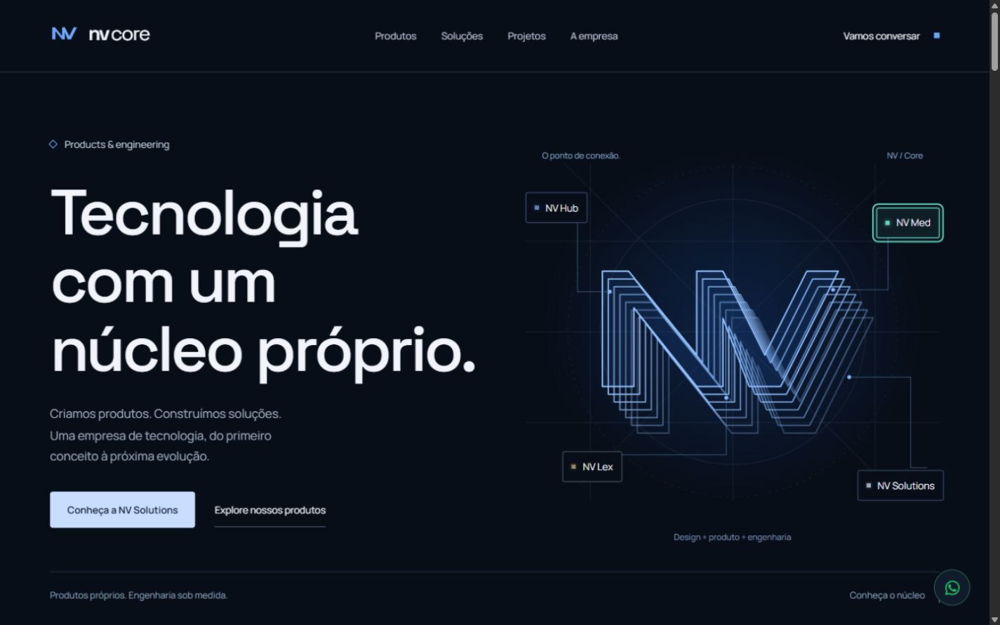
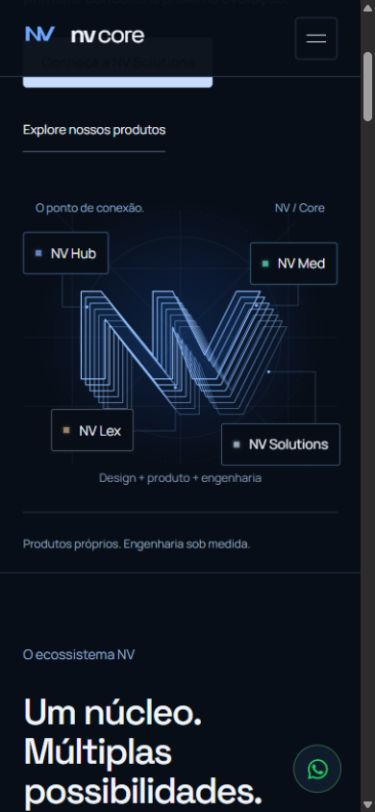

# Hero — Interactive Nodes

Refinamento de 7 de outubro de 2026, disponível na [prévia local](http://127.0.0.1:5175/).

## Implementação e escopo

Os quatro nodes mantêm dimensões, posições, tipografia, fundo escuro e cores existentes. O quadrado de cada submarca ganhou um halo pequeno e respiração lenta entre 70% e 100% de opacidade. Uma camada fina de borda varia discretamente, com durações e fases diferentes por produto.

Hover intensifica a borda, a luz e um preenchimento sutil, além de emitir um sinal extra pela conexão correspondente até o Core. O foco por teclado recebe a mesma linguagem visual, outline de 2 px e sinal extra. A emissão automática também produz uma intensificação curta no node de origem. A reação de chegada existente foi preservada; o sinal interativo tem intensidade um pouco maior.

Os links semânticos e destinos SPA permanecem intactos. Tab e Enter funcionam; Space mantém o comportamento nativo de links. O estado `:active` dá feedback imediato ao clique ou toque, sem interceptar ou atrasar a navegação. Todos os nodes conservam altura de 44 px no mobile. Não foi necessária uma seta adicional nem movimento de posição/escala.

O movimento usa GSAP existente e camadas SVG reutilizáveis. Há somente um sinal adicional por conexão, sem fila ao repetir hover durante seu percurso. A borda usa sombras estáticas em pseudo-elements com opacidade animada; não há novos filtros ou dependências. Observer e `visibilitychange` pausam o movimento fora da tela ou com documento oculto. Cleanup remove listeners e elimina timelines.

Movimento reduzido desativa respiração e sinais, mantendo hover/foco estáticos e contraste. Os tempos e caminhos dos sinais automáticos permanecem iguais aos da rodada anterior.

Nesta rodada, o código foi alterado somente em `app/refinements.css`, `components/nv/core-connection-pulse.tsx` e `components/nv/core-connection-motion.ts`. Headline, NV, linhas originais, grid, CTAs e demais seções foram preservados. Não houve commit, push ou deploy.

## QA

Build de produção, typecheck do build, lint e verificador existente passaram. O verificador foi executado contra a produção local na porta 5175 e cobre WhatsApp, nove rotas SSR, metadados, robots, sitemap, 404 e contraste.

Comparação visual e estrutural em 1920 × 1080, 1440 × 900, 1366 × 768, 390 × 844, 393 × 852 e 430 × 932: dimensões dos nodes, alinhamento horizontal, conteúdo e caminho original preservados, sem overflow horizontal. A diferença vertical de 6 px nas medidas corresponde à animação de entrada existente, capturada no início da baseline e concluída na versão final; as posições CSS não foram modificadas.

Os quatro links foram acionados no desktop e no viewport mobile, chegando às páginas corretas. Tab percorreu os quatro nodes com outline na cor da submarca e sinal extra; Enter navegou sem espera. Foram observados os quatro brilhos de emissão automática e a progressão do sinal extra sem reinício durante reentrada rápida.

Fora da tela, atributos dos sinais e opacidade das luzes permaneceram estáveis, retomando ao retornar. Três navegações Home → Solutions → Home conservaram quatro conexões, quatro tracks extras e nenhum pin spacer. O console de produção não apresentou warnings ou erros. Revisão do cleanup confirmou a remoção dos listeners e timelines.

O modo reduzido foi exercitado pelo ramo de QA de desenvolvimento existente, que usa a mesma condição de implementação: animações desativadas, sinais invisíveis e foco estático preservado. Não foi alterada a preferência do sistema operacional.

Os testes mobile utilizaram viewports do navegador e entrada de mouse; não foi exercitado um dispositivo físico de toque. Não foram realizadas medições de heap ou FPS.

[Evidências estruturadas](qa/hero-interactive-nodes.json) · [Verificador](qa/automated.json)

