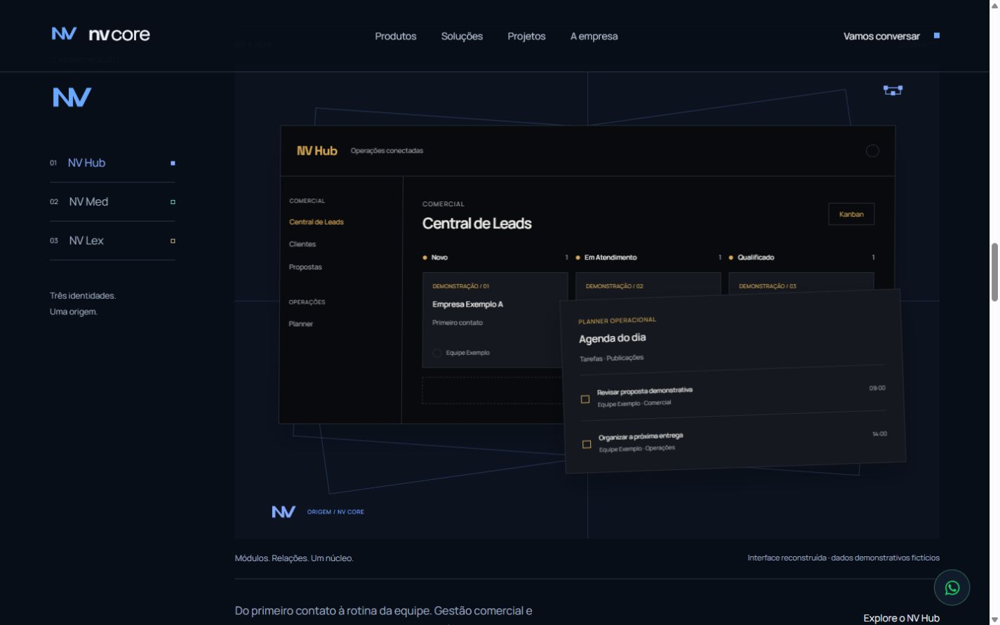
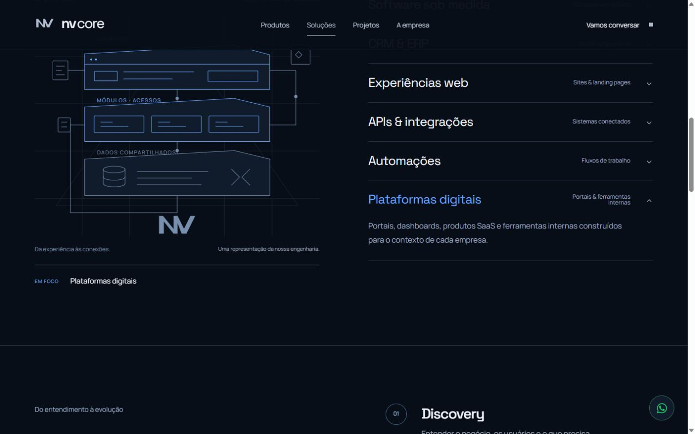
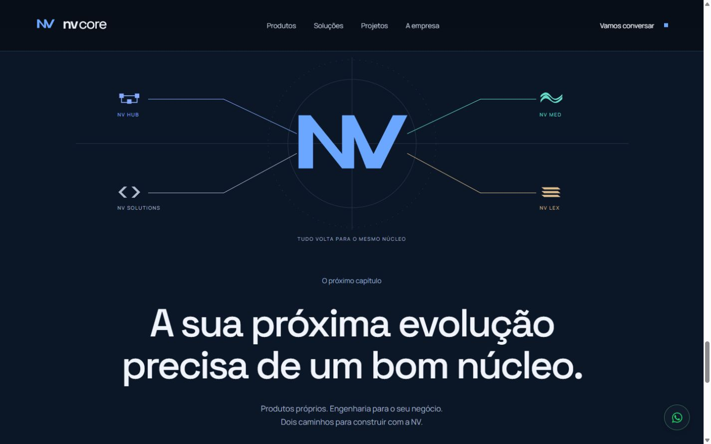
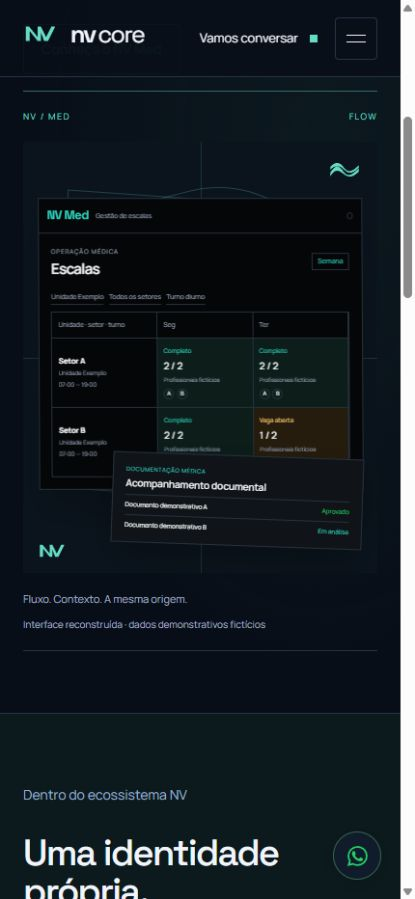

# NV Core — Entrega V2

7 de outubro de 2026. Implementação exclusiva neste repositório, disponível na [prévia local](http://127.0.0.1:5175/). Build de produção e verificações passaram. As alterações estão locais, sem commit, push, deploy ou alteração de DNS nesta rodada. O showcase real de NV Lex depende de uma fonte com código; essa limitação está detalhada abaixo.

## Preservado da V1

Mantidos dark/navy, azul elétrico, monograma NV, Manrope e Space Grotesk locais, headlines editoriais e posicionamento institucional. A narrativa continua partindo do Core para produtos próprios e engenharia sob medida. Também foram preservados navegação, metadados, componentes acessíveis e o formulário que prepara uma mensagem para WhatsApp.

As frases principais da Home continuam organizando a experiência: “Tecnologia com um núcleo próprio”, “Um núcleo. Múltiplas possibilidades”, “O que a sua empresa precisa construir?”, “Produtos que carregam a nossa assinatura” e “A sua próxima evolução precisa de um bom núcleo”.

## Refinado

A Home agora possui cinco atos visuais: Core, ecossistema, engenharia, produtos e convergência. Interfaces e diagramas interrompem a repetição de headline/parágrafo, com intervalos mais silenciosos entre os momentos de impacto.

As páginas internas também evoluíram. Products contém o showcase completo; Hub aproxima gestão comercial e planner; Med organiza escala, cobertura e documentação; Lex mantém uma composição própria de identidade. About apresenta o ciclo projetar/desenvolver/operar/evoluir, Projects incorpora recortes dos produtos e Contact explicita o caminho contexto → mensagem → WhatsApp. O header recebe acentos da submarca e o footer funciona como epílogo.

## Product Showcase

Três apresentações verticais substituem a seleção em abas na apresentação principal. No desktop, uma coluna persistente mantém a origem NV Core visível; no mobile, essa orientação vira uma sequência simples de links. Cada produto recebe título, símbolo, ambiente e composição próprios.

Hub combina um recorte de Kanban com uma agenda em outra camada. Med combina matriz de escalas com estados documentais. As interfaces usam máscaras, profundidade, planos e montagem vinculada ao scroll. Entre os produtos, o símbolo e a assinatura Core retomam o centro da narrativa. Lex apresenta somente sua identidade, identificada como tal.

As figuras Hub/Med informam “Interface reconstruída · dados demonstrativos fictícios”. São reconstruções editoriais de estruturas verificadas, sem mockup de navegador, dados reais ou vínculo com os sistemas dos produtos.

## Product Research

A pesquisa foi somente leitura pelo conector GitHub. Não houve checkout, edição, commit, push, cópia de configuração privada ou consulta a dados de produção dos produtos. Nenhum asset externo foi copiado. A [pesquisa completa](PRODUCT-RESEARCH.md) registra fontes fixadas aos commits analisados e os limites de cada afirmação.

| Produto | Elementos reais utilizados | Identidade |
| --- | --- | --- |
| NV Hub | Central de Leads: Novo, Em Atendimento e Qualificado; planner com tarefas e publicações; módulos de clientes e propostas | Superfícies escuras e dourado do design system dentro da UI; azul institucional preservado na composição |
| NV Med | Matriz de escalas por unidade/setor/turno, cobertura e conflitos; estados documentais Aprovado/Em análise e acompanhamento de validade | Teal e superfícies escuras dos tokens, sem símbolos médicos genéricos |
| NV Lex | Nenhuma interface ou funcionalidade verificável: `GabrielRossanesi/nvlex` está vazio | Identidade institucional existente preservada; nenhuma função jurídica inventada |

Os nomes, horários, contagens, empresas, unidades, setores, equipes e documentos das novas composições são demonstrativos. Recursos previstos, integrações não verificadas e disponibilidade de serviços externos não foram apresentados como comprovados.

## NV Solutions

Seis capacidades alteram uma arquitetura visual compartilhada: software, CRM/ERP, web, integrações, automações e plataformas. Cada seleção muda estrutura e labels, além do texto: módulos, tabela, interface web, conexão API, cadeia entrada/regra/ação e acessos com dados compartilhados.

O desktop mantém um painel persistente ao lado das capacidades. O celular coloca a composição dentro da capacidade aberta, criando uma leitura vertical. A interação funciona por teclado; o painel ativo tem anúncio textual. Os diagramas são identificados como representações da engenharia, sem expor infraestrutura real.

## Motion

- Core: montagem das camadas, resposta discreta ao ponteiro em dispositivos compatíveis e movimento associado ao scroll.
- Ecossistema: desenho de conexões e revelação coordenada dos ramos.
- Engenharia: montagem de camadas e transição para a capacidade selecionada.
- Produtos: revelação dos planos e recortes com deslocamentos e escalas pequenos; atualização da orientação lateral.
- Convergência: conexões das submarcas retornam ao monograma antes dos dois caminhos finais, Solutions e produtos.
- Rotas: pequena assinatura contextual, sem tela de carregamento ou bloqueio do conteúdo.

O scroll permanece nativo. Não há seções presas por pinning. `gsap.matchMedia()` coordena as condições de viewport e movimento reduzido; o contexto reverte timelines e triggers nas trocas de rota. Listeners, ResizeObserver, timers e frames têm cleanup. O refresh do painel de capacidades é consolidado pelo observer, sem atualização contínua a cada frame.

A restauração do histórico foi corrigida para distinguir novos fragmentos de entradas anteriores: voltar a uma seção restaura sua posição, enquanto novos links diretos seguem a âncora. O modo reduzido mantém todo o conteúdo visível e elimina os triggers.

## Brand System

Os símbolos e a família NV existentes continuam reconhecíveis. Hub absorve o dourado real apenas na interface; Med usa sua linguagem teal de organização operacional; Lex preserva alinhamentos e planos champagne. Solutions utiliza arquitetura em camadas. Tipografia institucional e origem Core conectam todas as experiências.

Na revisão de direção de arte, o protagonismo foi concentrado nas composições, sem adicionar mosaicos de cards, stock corporativo, métricas inventadas, cursor decorativo ou efeitos de brilho concorrentes.

## Mobile

Showcase vertical, orientação sem sticky lateral e escala com dois dias legíveis. O painel documental do Med passa para uma posição separada, reduzindo sobreposição. A engenharia acompanha a capacidade aberta; o título escolhido permanece visível após a troca. Parallax e amplitude de montagem são menores, e a reação ao ponteiro não opera em touch.

O WhatsApp usa superfície navy e ícone verde, com alvo de 52 px no desktop e 50 px no celular e espaçamento de safe-area. Continua acessível em todas as rotas, com o número `+55 11 95884-6541`.

## Performance

Não foram adicionadas dependências de runtime, fontes, imagens de produto ou assets remotos. As novas composições usam HTML/CSS/SVG; as apresentações de produto são renderizadas no servidor. GSAP continua carregado sob demanda. Transform e opacity concentram os movimentos; não há loop permanente de animação nem scroll artificial.

O CSS passou de 13.319 para 17.299 bytes gzip: acréscimo de 3.980 bytes, aproximadamente 3,9 KiB. Os maiores chunks compartilhados permaneceram iguais. O chunk GSAP medido possui 24.041 bytes gzip. A [inspeção de transferência](qa/v2-transfer.json) registra HTML e referências a scripts por rota; a Home possui HTML de 16.956 bytes gzip.

Esses valores são inventário de arquivos e estimativas gzip, não uma medição de primeira visita em rede. LCP, CLS e INP foram revisados estruturalmente: conteúdo principal em SSR, fontes locais com swap, composições dimensionadas e movimentos sem alterar o fluxo. Não foram executados Lighthouse, medição de campo, NVDA ou testes de FPS em celulares físicos; não há alegação de nota ou 60 FPS comprovados.

## QA

Build de produção, lint e typecheck passaram. O verificador existente passou com 13 assertions de contato e testes de rotas, metadados, H1, idioma, OG, JSON-LD, robots, sitemap, página 404, ausência do antigo endpoint de contato e WhatsApp. [Resultado automatizado](qa/automated.json).

| Viewport | Rotas verificadas | Overflow horizontal | Pin spacers |
| --- | ---: | --- | --- |
| 1920 × 1080 | 9/9 | Nenhum | Nenhum |
| 1440 × 900 | 9/9 | Nenhum | Nenhum |
| 1366 × 768 | 9/9 | Nenhum | Nenhum |
| 390 × 844 | 9/9 | Nenhum | Nenhum |
| 393 × 852 | 9/9 | Nenhum | Nenhum |
| 430 × 932 | 9/9 | Nenhum | Nenhum |

As 54 combinações foram repetidas no build final, com dimensões efetivas conferidas e um H1 por página. [Matriz responsiva](qa/v2-responsive.json).

O percurso real Home → Solutions → Home → Products → Med → Lex → Hub → About → Contact passou. A quantidade de triggers permaneceu específica de cada rota, sem acumulação: Home 8 no desktop/6 no mobile, Solutions 3/1, Products 5 e produtos individuais 1. [Navegação e histórico](qa/v2-navigation.json).

Também foram verificados:

- Scroll lento pelas composições e passagem rápida até o encerramento da Home.
- Back/forward: Home `#showcase-med` restaurou exatamente `scrollY=5288` e a mesma posição da seção.
- Acesso e refresh de `solutions#integrations`; seleção correspondente preservada. Refresh de `contact?intent=product&product=med` preservou produto NV Med.
- As seis capacidades no mobile e no desktop, incluindo atualização dos diagramas e uma capacidade aberta. [Desktop](qa/v2-capabilities-desktop.json), [interações](qa/v2-capabilities.json).
- Menu mobile: Escape devolve foco ao botão, Tab permanece no diálogo e navegar fecha o menu com foco no conteúdo. Skip link e navegação de capacidades por teclado passaram.
- Formulário inválido: erro e foco no primeiro campo; mensagem preenchida com dados fictícios: URL e formatação corretas. Nenhuma mensagem foi enviada ao WhatsApp.
- Nove rotas no ramo de movimento reduzido do ambiente de desenvolvimento: conteúdo visível e zero triggers. O override de QA não opera em produção; a preferência real é tratada pelo media query. [Evidência](qa/v2-reduced-motion.json).
- Console final sem erros ou warnings nas observações. Contrastes medidos: texto 17,67:1, corpo 8,69:1, ícone WhatsApp 8,65:1, UI Hub 8,30:1 e UI Med 9,94:1.

## Pendências

NV Lex precisa do repositório correto ou outra fonte aprovada com código/interface. O repositório localizado está vazio; foi solicitada sua localização. Enquanto isso, a apresentação é explicitamente de identidade, sem funcionalidades atribuídas. Hub e Med já receberam apresentação baseada em código real.

Publicação permanece fora desta rodada, conforme o briefing. A V2 está disponível para revisão local.

## Referências de trabalho

[Discovery](V2-DISCOVERY.md) · [Product Research](PRODUCT-RESEARCH.md). Foram aplicadas as skills disponíveis de direção de frontend, UI, acessibilidade e finalização. Para GSAP, as referências primárias foram [matchMedia](https://gsap.com/docs/v3/GSAP/gsap.matchMedia()/) e [ScrollTrigger](https://gsap.com/docs/v3/Plugins/ScrollTrigger/).
