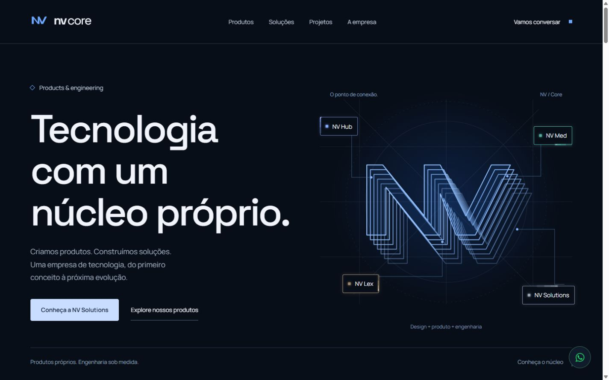
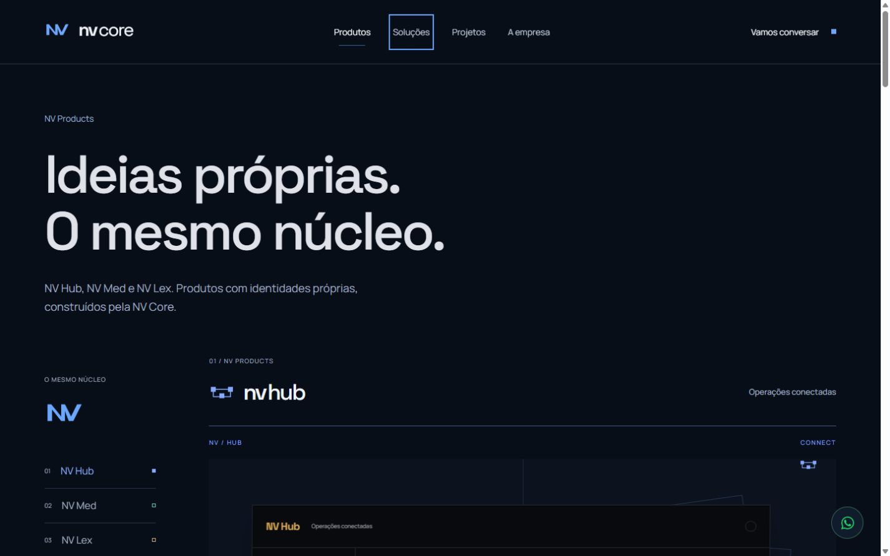
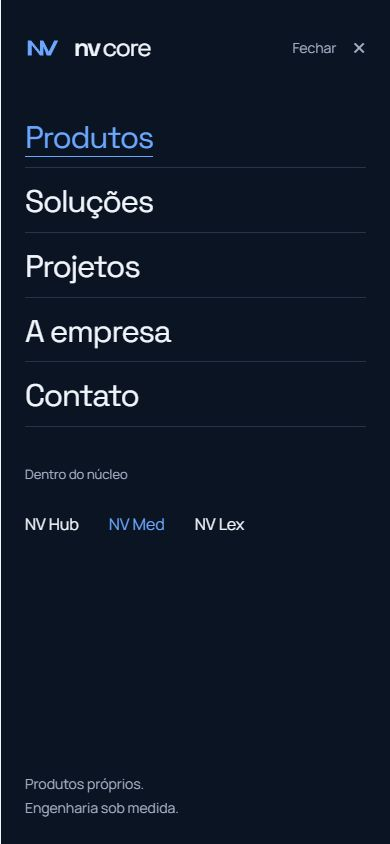

# V3 — Energy Nodes + Navigation Motion

Implementação local de 7 de outubro de 2026. [Prévia](http://127.0.0.1:5175/).

## Energy Nodes

Cada node recebeu um circuito SVG sobre sua borda existente. Quatro camadas sobrepostas formam uma única partícula: halo, rastro, corpo e núcleo. Seus segmentos têm a ponta alinhada, deixando a dissipação atrás do núcleo. O perímetro normalizado percorre os quatro lados e cantos sem medir o layout a cada frame, adaptando-se às dimensões reais do node.

Uma única timeline repetida por produto coordena volta completa → intensificação da borda → transmissão pela conexão existente → reação de chegada → pausa. Foram removidos os tracks extras de hover da versão anterior: permanecem quatro partículas de borda e quatro sinais de conexão, inclusive durante interações repetidas.

| Node | Fase inicial | Volta | Emissão | Transmissão | Pausa |
| --- | ---: | ---: | ---: | ---: | ---: |
| Hub | 1,2 s | 3,25 s | 200 ms | 1,3 s | 650 ms |
| Med | 2,1 s | 3,65 s | 200 ms | 1,45 s | 800 ms |
| Lex | 2,8 s | 3,45 s | 200 ms | 1,6 s | 700 ms |
| Solutions | 3,5 s | 3,85 s | 200 ms | 1,5 s | 900 ms |

Hover/foco intensificam luz e conexão e aceleram moderadamente a mesma timeline até 1,2×, com transição de 300 ms. Não há reinício ou duplicação de partículas. Os links continuam navegando imediatamente. As cores são os tokens existentes das submarcas; no mobile, a intensidade da transmissão é reduzida para 85% e a reação de chegada é menor.

Borda e status light respiram dentro da timeline do circuito. As sombras são estáticas; a intensidade muda por opacidade. Sem filtros pesados, novas dependências ou renders React por frame. IntersectionObserver e visibilidade do documento pausam o conjunto. Cleanup remove listeners, tweens de interação e timeline principal.

## Navigation Motion

Adotada a abordagem B: um indicador compartilhado percorre os links do menu, com transições CSS de 320 ms. Na primeira entrada, ele é posicionado no centro da palavra antes de expandir para os lados; entre links, posição e comprimento transitam suavemente. Medidas são lidas somente na entrada/foco, sem listener de pointermove ou leituras contínuas.

A página atual conserva uma linha discreta de 72% do texto e opacidade 55%, independente do indicador de hover. `usePathname` identifica também rotas internas de produtos, com `aria-current`. Mudança de rota e resize limpam a interação transitória. O texto muda de luminosidade sem alterar peso ou largura.

O CTA preserva suas dimensões e o quadrado existente: recebe linha fina, brilho e deslocamento de 2 px no quadrado. O logo permanece intacto. No mobile, o menu existente mantém sua estrutura e passa a identificar tanto Produtos quanto o produto atual. Há feedback estático de toque e foco visível.

Movimento reduzido remove partículas, respiração e sinais, mantém bordas e indicadores estáticos, desativa deslocamentos do header e conserva feedback de hover/foco. O header acompanha o modo de movimento do conteúdo, inclusive após mudanças de rota.

## QA

Build final, typecheck do build, lint e testes existentes passaram. O verificador foi executado contra a produção local na porta 5175: WhatsApp, nove rotas SSR, metadados, robots, sitemap, 404 e contraste. O console de produção não apresentou warnings ou erros.

Foram observados pelo menos três ciclos completos de cada node em **1920×1080, 1440×900, 1366×768, 390×844 e 430×932**. Em cada resolução foram registrados perímetro completo, emissão, transmissão e chegada. As cinco capturas estão em `docs/qa/v3-<largura>.jpg`.

A comparação confirmou header, espaçamentos, medidas dos links e CTA, dimensões dos nodes, tipografia, conteúdo, alinhamento horizontal e geometria das conexões preservados, sem overflow. A baseline foi capturada com as animações de entrada existentes ainda em andamento em uma aba em segundo plano; as diferenças verticais de 6 px nos nodes e aproximadamente 11–13 px na headline correspondem a esses transforms, sem alteração das posições CSS. Medições numéricas usam tolerância de 0,01 px.

Verificados os quatro links de navegação, o movimento entre eles, ativo persistente ao interagir com outro link, SPA, voltar/avançar, acesso direto e refresh de Med, CTA, Tab/Enter e foco visível. Durante scroll, o header permaneceu em `y=0`, mantendo ativo e interação. Os quatro destinos dos nodes passaram no desktop e no viewport mobile. Menus de 390 e 430 px identificaram a família/produto; Escape devolveu o foco ao botão após a transição de fechamento.

Fora da tela, os valores do circuito permaneceram estáveis e retomaram ao retornar. Três navegações Home → Solutions mantiveram quatro circuitos/sinais na Home e zero em Solutions. A implementação de cleanup também foi revisada.

Movimento reduzido foi exercitado pelo ramo de QA de desenvolvimento já existente, compartilhado com o comportamento da preferência real: zero sinais, partículas ocultas, bordas estáticas, underline/foco preservados e CTA sem deslocamento. Não foi alterada a preferência do sistema. Mobile foi testado por viewport e entrada de mouse; não houve teste em dispositivo físico nem medição de FPS/heap.

Aplicada a skill disponível `morales-ui-premium`. As skills específicas da Anthropic frontend design, GSAP e scrolling não foram encontradas na instalação; foram mantidos GSAP e padrões locais, consultando a documentação instalada do Next.js. Não foi necessário usar Figma.

## Escopo e entrega

Alterados somente o circuito e a coordenação do hero, as microinterações/estado ativo do header e seus estilos, além deste relatório e evidências. Outras seções, páginas, copy, layout, tipografia, assets, logo e identidade foram preservados. Não houve commit, push, deploy ou alteração externa nesta rodada.

[Evidências estruturadas](qa/v3-energy-navigation.json) · [Testes existentes](qa/automated.json)

